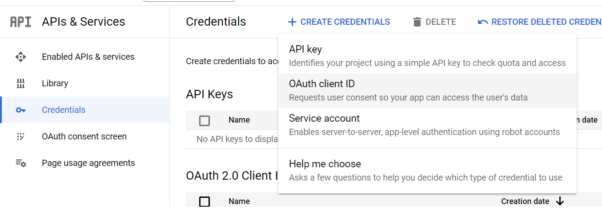
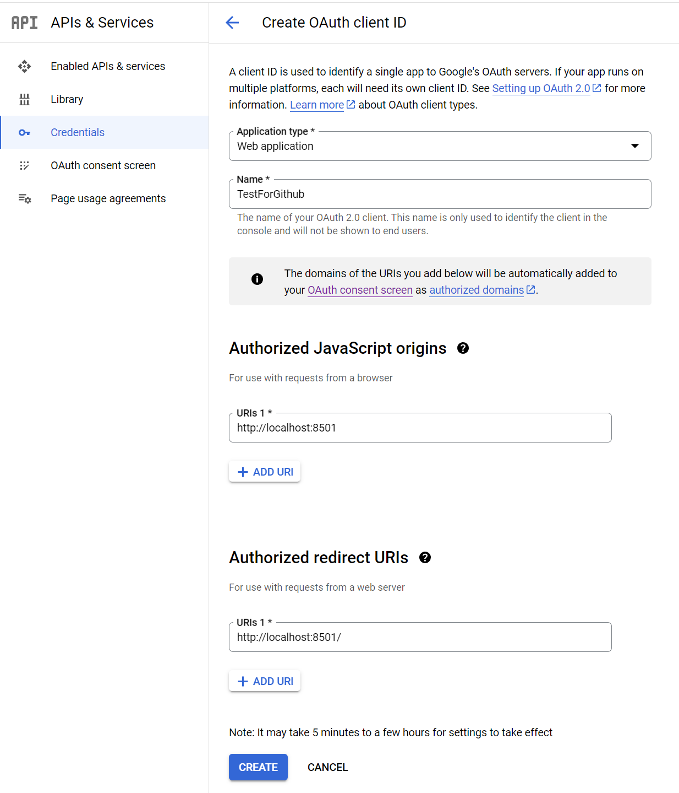
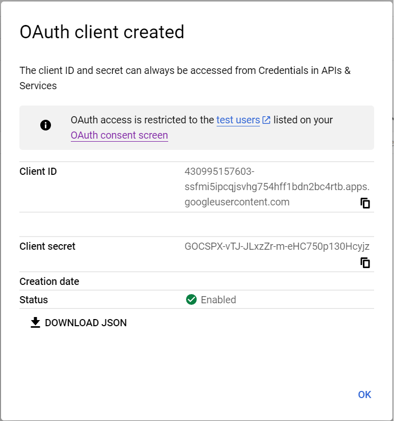

# streamlit-gauth

A simple app to Demonstrate using Google as IDP provider for a Streamlit App

## Install Instructions

### Google Cloud Configuration

1. Create a new project on the Google Cloud Console:
    -  Go to the [Google Cloud Console](https://console.cloud.google.com/)
    - Create a new project or select an existing one.

2. Enable the Google Sign-In API:
    - In the Google Cloud Console, navigate to the “APIs & Services” > “Library” section.
    - Search for “Cloud Identity” and enable it for your project.
3. Configure the OAuth consent screen:
    - In the Google Cloud Console, navigate to the “APIs & Services” > “OAuth consent screen” section.
    - Choose an “External” user type and click “Create”.
    - Provide a name for your application, enter the authorized domain (e.g., localhost for local development), and add any additional required information.
    - Save.
4. Create OAuth credentials:
    - In the Google Cloud Console, navigate to the “APIs & Services” > “Credentials” section.
    - Click “Create Credentials” and select “OAuth client ID”.
    - Choose “Web application” as the application type.
    - Enter a name for the OAuth client ID.
    - Add the authorized JavaScript origins (e.g., http://localhost:8501 for Streamlit’s default development server).
    - Add the authorized redirect URI (e.g., http://localhost:8501/).
    - Click “Create” to generate the OAuth client ID and client secret.





### Python configuration
1. Clone the git repo

```
git clone https://github.com/vivekuppal/streamlit-gauth.git
cd streamlit-gauth
python -m venv venv
venv\scripts\activate.bat
pip install -r requirements.txt
```

2. Configure the app
```
Replace CLIENT_ID, CLIENT_SECRET, PROJECT_ID in app.py with appropriate values
```

3. Execute the app
```
streamlit run app.py
```
